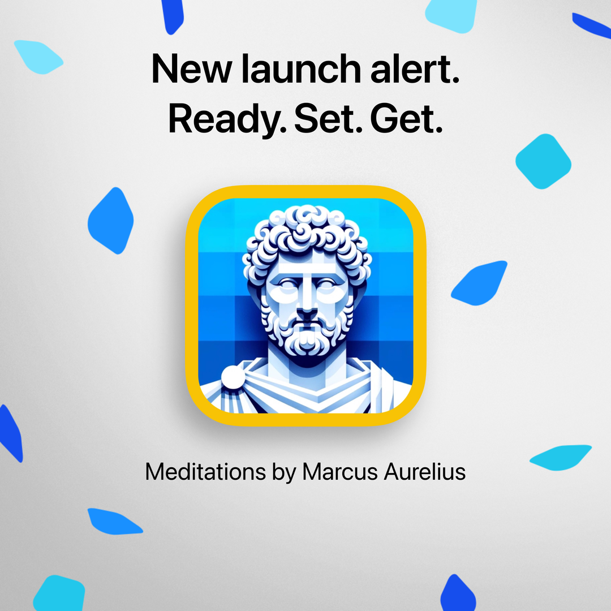
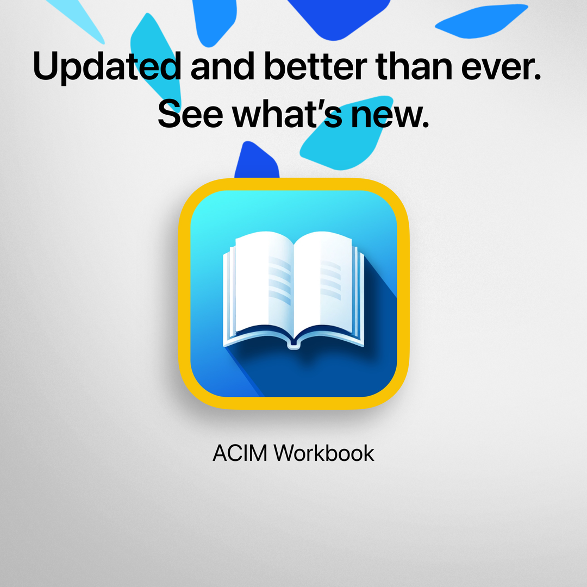
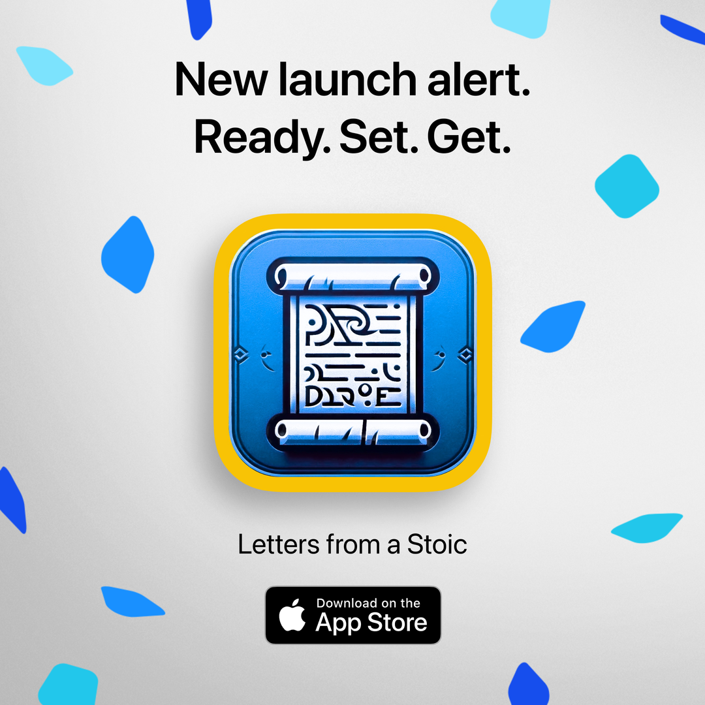

# Amund Ring - Frontend & Mobile App Developer

I’m a creative developer dedicated to building user-friendly, visually appealing applications. With a strong background in frontend and mobile app development, I aim to create simple, enjoyable user experiences.

## 🚀 Skills

### **Mobile App Development**  
- Swift / SwiftUI / UIKit  
- React Native  
- Expo  

### **Frontend Development**  
- JavaScript / TypeScript  
- React / Vue.js / Next.js  
- HTML / CSS / Sass / CSS Modules / Tailwind CSS / Styled Components  

### **Design Tools**  
- Figma  
- Pixelmator Pro  
- Photoshop  

## 📱 Published Apps

- **[Florence Scovel Shinn](https://apple.co/4dRUivg)**
- **[Meditations by Marcus Aurelius](https://apple.co/3Mygopg)**
- **[ACIM Workbook](https://apple.co/4cWbCfY)**
- **[Letters from a Stoic](https://apple.co/48kprUZ)**

##

    &nbsp;
  &nbsp;
  &nbsp;
  

